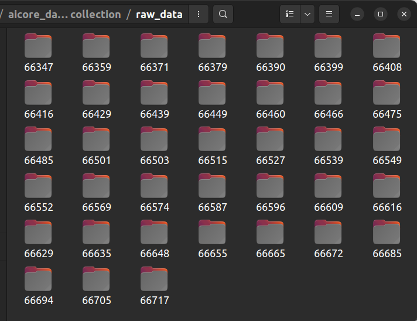

# aicore_data_collection

## Milestone 2: Decide which website you are going to colect data from

This project will be about webscraping statistics from the premier league website.

I will be analysing match results for Manchester United as they are the team that I support. They have been doing very poorly in recent years and I am hoping that looking at this data will provide some insight.

## Milestone 3: Prototype finding the individual page for each entry

I have made a Scraper class with a wait time used so that the webpage fully loads.

Methods were added to accept the cookies and to scroll down the page. The method used to retrieve the Manchester United games was also added - making sure to consider both home and away fixtures.

The following code first searches for these games:

```python
fixture_list = self.driver.find_element(By.XPATH, '//*[@class="fixtures"]')
        home_games = fixture_list.find_elements(By.XPATH, '//*[@data-home="Man Utd"]')
        away_games = fixture_list.find_elements(By.XPATH, '//*[@data-away="Man Utd"]')
```
## Milestone 4: Retrieve data from details page

A method was created to scrape the statistics of each game.

All data is to be stored locally in the folder "raw_data" as .json files.

For each game a number of statistics were considered, including the goals scored, possession and cards given throughout the game amongst many others.

By using a method to create a dictionary this data could be stored in the following way:

```python
stats_dictionary = {'Match ID': match_id,
                                'V4 UUID': str(self.generate_uuid()),
                                'Date': date,
                                'Location': location,
                                'Home or Away': home_or_away,
                                'Result': result[2],
                                'Goals scored': result[0],
                                'Goals against': result[1],
                                'Possession': float(stat_list[0][0]),
                                'Shots on target': int(stat_list[1][0]),
                                'Shots': int(stat_list[2][0]),
                                'Touches': int(stat_list[3][0]),
                                'Passes': int(stat_list[4][0]),
                                'Tackles': int(stat_list[5][0]),
                                'Clearances': int(stat_list[6][0]),
                                'Corners': int(stat_list[7][0]),
                                'Offsides': int(stat_list[8][0]),
                                'Fouls conceeded': int(stat_list[-1][0])}
```
The resulting extracted data shows up ass follows in the raw_data folder - each containing a .json file.

